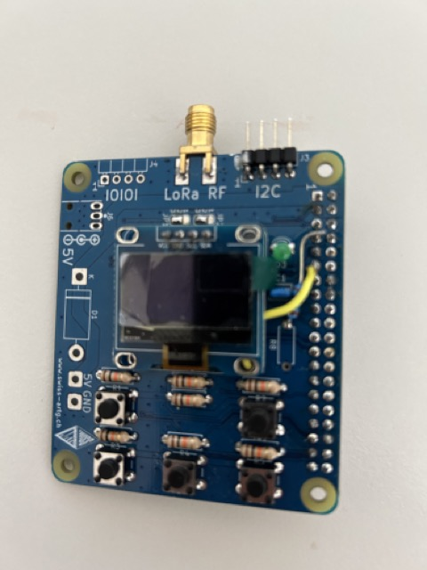
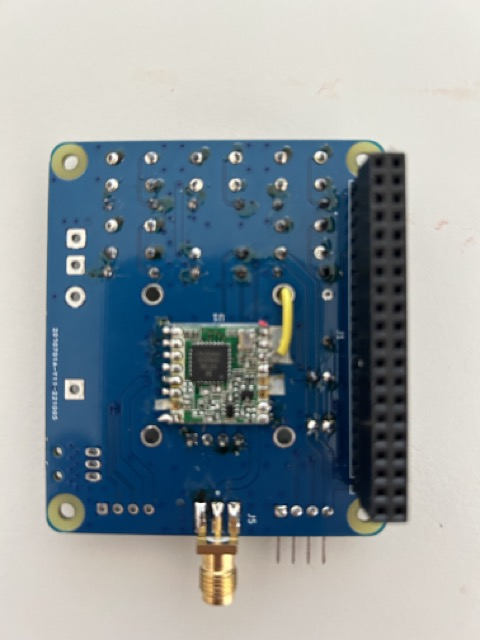

# Installation LoRa APRS iGate Software (Raspberry PI)

Autor: <hb9pae@gmail.com>  
Revision: 2023-09-09, Version 1.0.1  
Revision: 2023-09-10, Version 1.0.1a    Typo  
Revision: 2023-09-13, Version 1.0.1b    Typo  
Revision: 2024-03-24  Version 1.2       Boardrevision  
Revision: 2024-09-10  Version 1.3       Debian 12 Paket

## Voraussetzungen

Diese Installationsanleitung basiert auf:
- Raspberry PI Modell 3 oder 4
- Raspbian Debian GNU/Linux 12 (bookworm)
- Python Version 3.12
- LoRa iGate Aufsteckboard swiss-artg.ch (modifiziert oder Version 2)
- Erstelle eine SD-Karte (> 8 GB) mit einem Benutzer "pi", erlaube den Zugriff über SSH

### Modifikation RPI-Board

Die neue Version vom RPI-Board muss nicht mehr modifiziert werden. Versions-Beschriftung
oberhalb Diode D1: «231125».  

Das alte RPI-Board (Ohne Versionsbeschriftung) der SWISS-ARTG muss für den Interrupt-Betrieb
modifiziert werden:

- Verbinde Pin14 vom RFM96W (DIO 0) mit Pin 11 (BCM17) vom RPI 40-pol Header.

 
 

## Installation

Installiere unter dem Benutzer "root" folgende Pakete:

- sudo apt update
- sudo apt upgrade
- sudo apt install git
- sudo apt install python3-pip
- sudo apt install python3-dev
- sudo apt install libopenjp2-7-dev
- sudo apt install libtiff-dev
- sudo apt install librrd-dev
- sudo apt install libpython3-dev

Die Python Sourcen werden im Verzeichnis "/opt" installiert. Dazu setzen wir die notwendigen Berechtigungen:

- sudo chmod 777 /opt/          # Erlaube Lese- und Schreib-Zugriff für alle User  
- sudo usermod -aG adm pi       # Erlaube Lese- und Schreib-Zugriff im Verzeichnis </var/log>
- sudo chmod 777 /var/log       # Erlaube Lese und Schreibberechtigung Verzeichnis </var/log>

Wir erstellen für den User "pi" eine virtuelle Python Umgebung für die Applikation:

- python -m venv  /opt/lora
- source /opt/lora/bin/activate         # wir aktivieren die virt. Umgebung

Installiere die Sourcen (als User "pi"):

- cd /opt/
- git clone <https://github.com/hb9pae/RPI-iGate-LoRa.git>
- cd /RPI-iGate-LoRa

### Die Python3 Pakete, werden als Benutzer pi innerhalb der virt. Umgebung "lora" installiert

- pip3 install aprslib
- pip3 install smbus2
- pip3 install loralib
- pip3 install aprslib
- pip3 install flask
- pip3 install Pillow
- pip3 install Adafruit-SSD1306
- pip3 install rrdtool
- pip install oled-text
- pip3  install gpiozero
- pip3 install flask_basicauth
- pip3 install lgpio

### WiringPi Library

Wir installieren nun WiringPi. Einige Debian Versionen verwenden eine veraltete WiringPi Bibliothek. Prüfe die WiringPi Version
und installiere die aktuelle Version:

- sudo dpkg -l | grep wiringpi      # Version muss gösser als V3.2 sein

Die aktuellen Versionen sind unter <https://github.com/WiringPi/WiringPi/releases/> verfügbar. Für den RPI 3+ benötigen
wir die ARM64 Version:

- cd /opt
- wget <https://github.com/WiringPi/WiringPi/releases/tag/3.X>   # Version anpassen ARM64 Version laden!
- sudo dpkg -i wiringpi_3.2_arm64.deb

### Konfiguration Raspberry PI Interface

- sudo raspi-config
  - ssh enable
  - i2c enable
  - spi enable
  - serial interface enable
- sudo reboot  

### Kompilieren und Test der Library

- cd /opt/RPI-iGate-LoRa
- cd LORA

Passe die  aktuelle Python Version im Makefile an: Python Version 3.XX

- make clean
- make all

Wir testen die Bibliothek

- ./lora_app.exe test

####  Ausgabe

''' $ ./lora_app.exe test

SX1276 detected, starting.
Print Register 
Version: 0x12
FRF_MSB: 0x6c
FRF_MID: 0x71
FRF_LSB: 0x99
Sync Word: 0x12
FIFO: 0x9a
OPMODE: 0x8d
FIFO Addr: 0x1
FIFO TX Base: 0x80
FIFO RX Base: 0x0
RX NB Bytes: 0x0
FIFO RX Current: 0x0
IRQ: 0x0
DIO 1: 0x0
DIO 2: 0x0
Modem Config: 0x72
Modem Config 2: 0xc4
Modem Config 3: 0xc
SYMB Timeout: 0x5
SNR: 0x0
PayLoad: 0x40
IRW: 0x0
PayLoad LNG: 0x80
Hop Period: 0xff
Sync Word: 0x12
Version: 0x12 '''

Kopiere die LoRa-Library in das Programmverzeichnis:

- cp loralib.so ../

### Logfile

Das LogFile befindet sich unter /var/log/iGate.log und wird vom Benutzer pi beschrieben.
Wir erstellen ein leeres Logfile und passen die Rechte an.

- sudo touch /var/log/iGate.log
- sudo chown pi:pi /var/log/iGate.log

### Systemdienste

Installiere folgende Systemdienste:

### Startscript

- sudo cp utils/igate.service  /etc/systemd/system
- sudo systemctl enable igate.service
- sudo systemctl start igate.service

### LogRotate

- sudo cp utils/igate  /etc/logrotate.d/