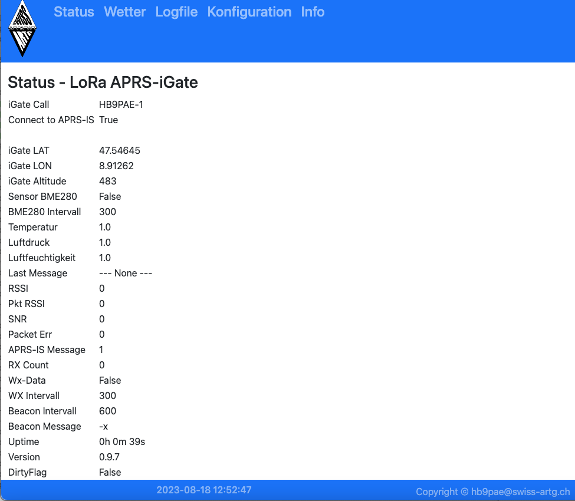

#	LoRa APRS-iGate für den Raspberry PI
(c) 2023, Peter Stirnimann, hb9pae@swiss-artg.ch

 

##	Allgemeines
Der LoRa APRS-iGate empfängt LoRa APRS-Positionssignale und leitet diese an das 
APRS-Datenbank weiter. Diese Positionsmeldungen können anschliessend unter http://aprs.fi 
angezeigt werden. 

Der aktuelle Status sowie die empfangenen Daten werden im Status-Report angezeigt. Der 
Status-Report kann mit einem Webbrwser unter <IP>:5000   (http://192.168,0.123:5000)  abgerufen werden.
 
Das Python Programm IGate.py steuert das LoRa RPI-Board der SWISS-ARTG mit dem RF95W Chip RF-Hope
als LoRa-Empfänger. Weitere Informationen zum RPI-Board unter:  https://www.swiss-artg.ch/index.php?id=174

###	Modifikation RPI-Board
Das RPI-Board der SWISS-ARTG muss für den Interrupt-Betrieb modifiziert werden.
Verbinde Pin14 vom RFM96W (DIO-0) mit Pin 11 (BCM17) vom RPI 40-pol Header.

###	Wetterstation
Falls ein Sensor BME280 angeschlossen ist ud aktiviert ist ("SENSOR BME280 = TRUE" und 
"Wx-Data = TRUE" werden die Sensordaten an APRS.FI gesendet. Die Sensordaten werden auch intern
um Menue "WETTER" angezeigt.

### 	Installation
Für die Installation wird ein IMAGE zur Verfügung gestellt. Kopiere das Image-File 
mit einem Imager-Programm (z.B. Raspberry Pi Imager) auf eine SD-Karte (mind. 8 GB).

## 	Inbetriebnahme
	- LoRa RPI-Board auf dem Raspberry PI aufstecken.
	- Die programmierte SD-Karte im RPI einstecken.
	- RPI mit dem lokalen Netzwerk verbinden.
	- PRI mit der Stromversorgung (5VDC) versorgen.

Nach dem ersten Start des Raspberry PI wird das Filesystem auf der SD-Karte expandiert, es 
folgen mehrere Restarts. Nach dem erfolgreichen Start des Programmes erscheint der Welcome-Bildschirm 
auf dem OLED-Display.

##	Konfiguration
Die Konfiguration der persönlichen Daten (Rufzeichen, Koordinaten etc.) erfolgt über den Web-Browser  auf der Adresse 
"http://<IP>:5000" . Trage deine personlichen Daten im Konfigurations-Formular ein und speichere  die Daten ab.
Die Parameter werden im File /opt/RPI-iGate-LoRa/igate.ini abgespeichert.

### 	Spezielle Parameter 
	- EN_APRSIS:	True / False	Bestimmt, ob die iGate -DAten an das APRS-IS System übermittelt werden.
	- EN_BME280	True / False	BME280 Sensor angeschlossen?
	- EN_WXDATA	True / False	Bestimmt ob die BME280 Sensordaten als WX-Bake an das APRS-IS geleifert werden.

##	Manueller Start des Programmes
Der manuelle Start erflogt mit dem Befehl: 
	- sudo systemcontrol start igate.service

##	Automatischer Start nach dem Booten
	- sudo systemctrol enable igate.service

## 	Bedienung
Die drei unteren Tasten auf dem RPI-Board wählen den Anzeigemode

	-	Taste links >  Status 
	-	Taste mitte	>  Konfiguration
	-	Taste rechts > Letzte Meldung 	 

Die beiden oberen Tasten neben dem Display aktivieren den Welcome-Screen.
 
## 	Bibliotheken
Das Python Programm verwendet die Bibliothek loralib.so (https://github.com/wdomski/LoRa-RaspberryPi). Es sind folgende 
Python Pakete notwendig:

Package / Version
-	Adafruit-GPIO    V 1.0.3
-	Adafruit-PureIO  V 1.1.11
-	Adafruit-SSD1306 V 1.6.2
-	aprslib          V 0.7.2
-	Pillow           V 9.5.0
-	pip              V 23.1.2
-	pkg_resources    V 0.0.0
-	setuptools       V 40.8.0
-	smbus2           V 0.4.2
-	spidev           V 3.6

## 	Hardwarekonfiguration
Der LoRa Treiber erwartet folgende Hardwarekonfiguration (File LORA/lora.c)
-	int ssPin = 10; //ChipSelect  BCM 8
-	int dio0  = 21; //IRQ  BCM 5
-	int RST   = 22; //RESET BCM 6

